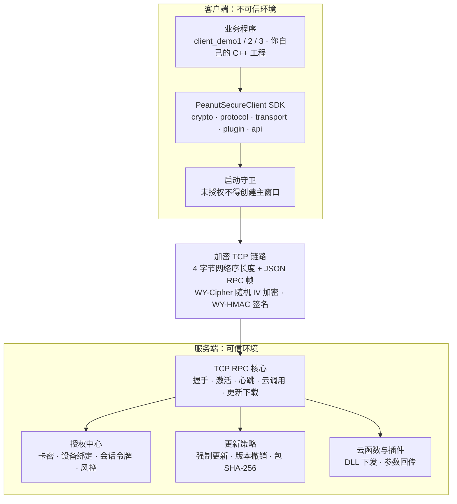
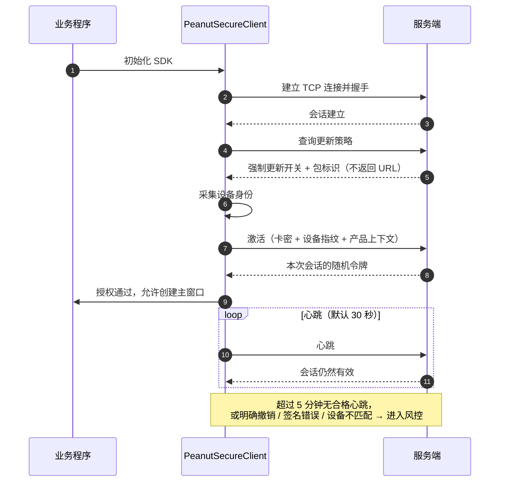
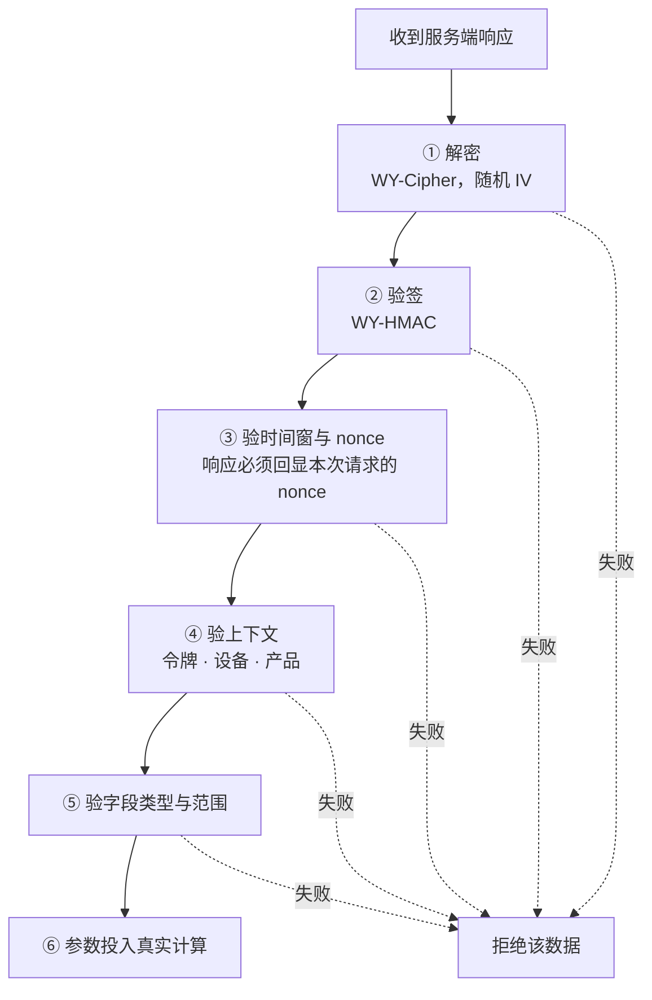
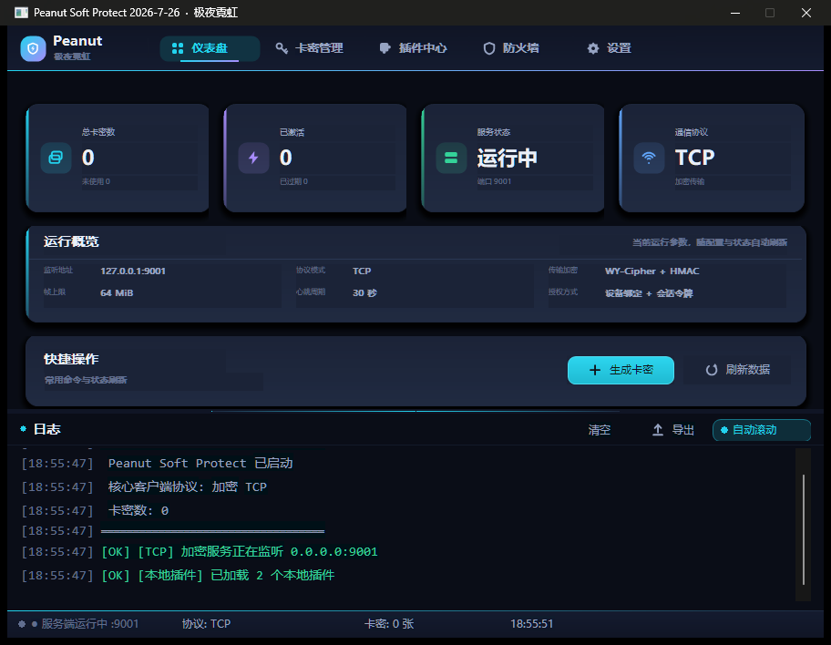
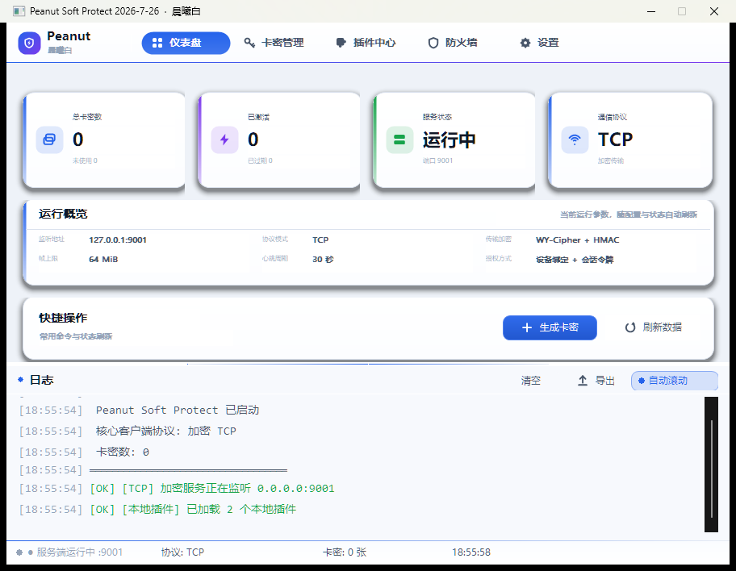
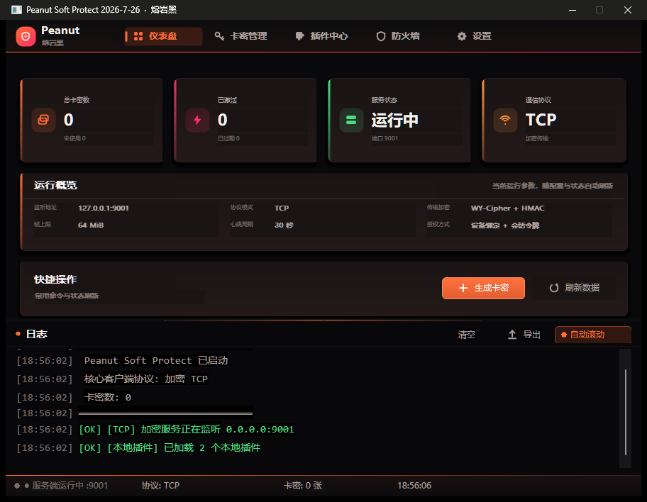

<div align="center">

# Peanut_WLYZ

**面向 Windows 原生 C++ 软件的联网授权、加密 TCP 通信、设备绑定与私有强制更新系统**

[](https://isocpp.org/)


[](LICENSE)

</div>

---

## 目录

- [一、项目简介](#一项目简介)
- [二、组件构成](#二组件构成)
- [三、目录结构](#三目录结构)
- [四、总体架构](#四总体架构)
- [五、启动顺序与验证顺序](#五启动顺序与验证顺序)
- [六、界面预览](#六界面预览)
- [七、构建](#七构建)
- [八、运行与测试](#八运行与测试)
- [九、关于密钥（重要）](#九关于密钥重要)
- [十、协议与安全要点](#十协议与安全要点)
- [十一、生产化待办](#十一生产化待办)
- [十二、许可证](#十二许可证)
- [十三、免责声明](#十三免责声明)
- [十四、交流社群](#十四交流社群)

---

## 一、项目简介

核心理念不是让客户端拿到一个可被改写的 `bool`，而是让服务器持续提供核心计算真正需要的、
会变化且与本次会话绑定的数据 —— 客户端脱离服务器后，即使绕过界面门禁，也无法重建完整业务结果。

> 本项目通过服务端状态、动态输入和多点依赖提高离线复制的成本，**不承诺“绝对不可破解”**。
> 客户端永远是不可信环境。真正的边界是服务器持续拥有客户端无法自行推导的状态和数据，
> 而不是把算法藏得更深。

## 二、组件构成

| 组件 | 职责 |
|------|------|
| `PeanutGUI.exe` | 卡密、设备绑定、插件、风控和更新策略管理 |
| `PeanutSecureClient` | TCP 连接、加密请求、签名验证、授权、心跳、云函数、TCP 更新下载 |
| `client_demo1/2/3` | 三套纯 C++ 集成示例 |
| `PeanutMockServer.exe` | 可执行验证服务器 |
| `PeanutIntegrationTest.exe` | 完整流程与负向安全测试 |

## 三、目录结构

```
src/PeanutClient/      SDK 核心（crypto / protocol / sdk / transport / plugin / api / util）
src/PeanutGUI/         管理端 GUI（原生 Win32）
src/PeanutMockServer/  验证服务器
src/PeanutTest/        单元测试
src/PeanutIntegrationTest/  集成测试
client_demo1..3/       集成示例
examples/              云插件示例（echo / scene / abogus / resume_live / system_info / monitor_policy）
vendor/                第三方头文件（cpp-httplib、nlohmann/json）
docs/                  反调试 / 反逆向设计文档与界面截图
keys/                  密钥目录（见下方说明）
Elang/SDK.e            易语言 SDK 封装示例
```

## 四、总体架构

左侧是运行在用户机器上的客户端，右侧是必须由自己掌握的可信服务端，中间只有一条加密 TCP 通道。



请求与响应全程走这一条链路：客户端发起的每一次业务调用都携带本次会话的随机 `nonce` 与时间戳，
服务端在响应里回显 `nonce`；更新包不暴露为 HTTP 静态资源，只能经该通道下载。

## 五、启动顺序与验证顺序

启动顺序是强制的：**未拿到授权之前，不允许创建或显示核心业务窗口。**



每一次收到服务端数据，都必须按固定顺序校验，任何一步失败都**不得回退到本地默认值**：



## 六、界面预览

管理端启动后的仪表盘如下，界面自带三套运行时皮肤，同一套布局换色即用：

<p align="center">
  
</p>

上图是默认皮肤「极夜霓虹」下的仪表盘：左侧为导航（仪表盘 / 卡密管理 / 插件中心 / 日志 / 设置），
主区四张指标卡分别显示总卡密数、已激活数量、服务端状态与通信协议；下方「运行概览」列出当前
监听地址、协议模式、传输加密方式、帧上限、心跳周期与授权方式；底部日志区实时输出服务端事件。
状态栏显示 `● 服务端运行中 :9001`、协议与卡密张数。

另外两套皮肤共用完全相同的布局与控件，仅替换配色与字体：

<p align="center">
  
  &nbsp;
  
</p>

左侧为浅色皮肤「晨曦白」，右侧为深色皮肤「熔岩黑」。切换方式：
命令行参数 `PeanutGUI.exe --skin=2`，或直接运行仓库内对应的主题启动脚本。

## 七、构建

需要 Visual Studio 2019/2022（MSVC v142 工具集，x64）。

```
powershell -ExecutionPolicy Bypass -File .\build_all.ps1
```

默认 `Release x64`，也可指定：

```
.\build_all.ps1 Debug x64
```

产物输出到 `bin\<配置>\`。`build_all.ps1` 会依次构建插件 DLL、测试工具、三套 client demo 与 GUI。

## 八、运行与测试

管理端 GUI：

```
bin\Release\PeanutGUI.exe
```

验证服务器（可选，GUI 内置同名服务端；独立运行便于联调）：

```
cd bin\Release
PeanutMockServer.exe 9001 keys
```

测试：

```
cd bin\Release
PeanutTest.exe
PeanutIntegrationTest.exe
```

> 注意：`PeanutIntegrationTest.exe` 会自行启动 `PeanutMockServer.exe`，两者需位于同一目录，
> 且当前工作目录下要有 `keys`。集成测试日志位于 `logs\integration_test.log`。

当前集成测试实测结果：**80 通过 / 0 失败**（`SUMMARY pass=80 fail=0`），覆盖三套 Demo 的 TCP 连接、
策略、激活、心跳、插件列表、云调用，云端参数参与本地真实计算，以及一卡跨设备拒绝、
非法令牌心跳与云调用拒绝、插件加载与执行。

---

## 九、关于密钥（重要）

`keys/` 目录中的密钥是**公开的演示密钥**，仅供本地编译、运行与联调使用。
它们已经完整写入本仓库（含服务端私钥），因此**任何人都可以伪造签名**。

**请勿在任何生产环境直接使用这些密钥。** 上线前应自行生成一套独立密钥：

1. 生成后替换 `keys/` 下的全部文件；
2. 同步更新客户端内嵌配置 `src/PeanutClient/sdk/embedded_client_config.h`
   （其中的密钥以混淆字节数组形式存放，`Decode()` 后即为明文）；
3. 重新编译全部客户端与示例。

密钥文件格式：

| 文件 | 内容 |
|------|------|
| `server_pubkey.hex` | `n_hex:e_hex` |
| `server_privkey.hex` | `n_hex:d_hex:p_hex:q_hex` |
| `cipher_key.hex` | 64 个十六进制字符（32 字节 WY-Cipher 密钥） |
| `hmac_key.txt` | HMAC 密钥字符串 |
| `psp_key.hex` | 64 个十六进制字符（PSP 会话密钥） |

需要说明的是，按设计客户端发布物**不应**落地任何可直接使用的密钥文件（含 `keys` 目录），
生产客户端应在编译期把密钥转为代码内混淆字节、运行到调用点才在内存中短暂解码。
本仓库保留 `keys/` + 内嵌配置两套，是为了让示例开箱可跑，便于理解协议流程。

## 十、协议与安全要点

- 默认链路为 TCP：4 字节网络序长度 + JSON RPC 帧，业务 JSON 经 WY-Cipher 随机 IV 加密、
  WY-HMAC 签名，请求携带随机 nonce 与时间戳，响应回显 nonce。
- 帧上限 64 MiB，读写采用完整收发循环，拒绝截断帧与超长帧。
- 客户端验证顺序固定：解密 → 验签 → 验时间窗与 nonce → 验 token/设备/产品上下文 →
  验字段类型与范围 → 参数投入真实计算。任一步失败都不得回退到本地默认值。
- 启动顺序强制：连接 TCP → 握手 → 检查更新策略 → 采集设备身份 → 激活 → 获得随机 token →
  创建主窗口。未授权状态不得创建或显示核心业务窗口。
- 心跳默认 30 秒；超过 5 分钟无合格心跳，或收到明确会话撤销、签名错误、设备不匹配时进入风控。
- 更新策略不返回 URL，包只能经已建立的加密 TCP 通道下载，下载后校验长度与 SHA-256。

详见 [产品与开发文档.md](产品与开发文档.md) 与 [使用与集成文档.md](使用与集成文档.md)。

## 十一、生产化待办

- 演示服务器的内存卡密/会话迁移到带唯一约束与事务的持久数据库，并记录登录、换绑、更新与云调用审计。
- 增加 nonce 缓存、严格时间窗、产品/租户分层派生密钥与密钥轮换。
- 更新清单增加独立非对称签名、单调版本防降级、失败回滚与断点续传。
- 插件执行迁移到低权限隔离进程，增加超时、内存/CPU 限额、崩溃恢复与调用审计。
- 对 WY-Cipher、WY-HMAC、RSA 握手与随机数实现进行独立密码学审计与模糊测试。
- 将 GUI 内置服务端与已验证的 TCP RPC 核心统一为同一实现，避免协议漂移。

## 十二、许可证

本项目采用 [GPL-3.0](LICENSE) 许可。

第三方组件：

- [cpp-httplib](https://github.com/yhirose/cpp-httplib)（MIT License，header-only，见 `vendor/httplib.h`）
- [nlohmann/json](https://github.com/nlohmann/json)（MIT License，见 `vendor/nlohmann/`）

## 十三、免责声明

本项目为授权与通信框架的技术实现，按“现状”提供，不附带任何明示或默示的担保，
包括但不限于对适销性、特定用途适用性与不侵权的担保。

- 请勿将本项目用于任何违反当地法律法规或侵犯他人权益的用途。
- 使用本项目即表示你自行承担全部风险与后果，作者不对因使用本项目造成的任何直接或间接损失负责。
- `keys/` 目录中的密钥为公开演示密钥，**严禁用于生产环境**；由此造成的安全问题与作者无关。
- 请在遵守目标软件许可协议与相关法律的前提下使用本项目。

## 十四、交流社群

<div align="center">

<p><strong>遇到问题？欢迎加群交流 —— 版本更新与问题答疑第一时间同步</strong></p>

<p>
<a href="https://qm.qq.com/q/89nIPLRrCU" title="易语言+AI-吹牛逼（群号 607124662）"></a>
&nbsp;&nbsp;
<a href="https://qm.qq.com/q/Fv9KjpGCEq" title="易语言 jadeView 前端UI（群号 1103426302）"></a>
</p>

<p>
<strong>易语言+AI-吹牛逼</strong> ｜ 群号 <code>607124662</code><br>
<strong>易语言 jadeView 前端UI</strong> ｜ 群号 <code>1103426302</code><br>
<strong>作者 QQ</strong> ｜ <code>245867</code>
</p>

<p><sub>点击上方按钮即可一键加群，无需手动搜索群号</sub></p>

</div>
